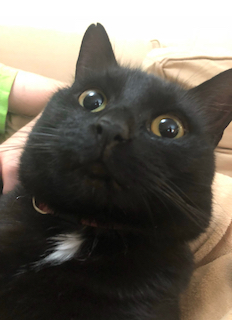

# Kalyn Muhlenberg 

### About Me

Hello! My name is **Kalyn Muhlenberg**. I am in my senior year here at Tufts (almost done!) and I am a Computer Science major. I’ve always loved coding, building projects, and solving problems through programming. Most of my experience has been with languages like C, C++, JavaScript, and Java, but I’m really excited to get more into Python in this class and see what I can do with it.  

I’m not usually a big humanities person, but I think this class will be a really cool way for me to mix CS with something totally different. I’m looking forward to seeing how it all comes together!  
 
### Fun Facts About Me
- I love collecting rocks (yes, rocks. Not pretty crystals or anything, just plain rocks).
- I absolutely love halloween. My apartment is decorated for halloween all year round.
- I enjoy doing my own nails and experimenting with nail art (I’m not an expert, but it’s lots of fun!)
- I have 4 cats at home named Zeus, Mynie, Sammy, and Ducky. Here are some photos of them!  

I'm excited to work with all of you this semester!

*I used [GitHub Docs: Basic writing and formatting syntax](https://docs.github.com/en/get-started/writing-on-github/getting-started-with-writing-and-formatting-on-github/basic-writing-and-formatting-syntax#links) to help with markdown styling.*